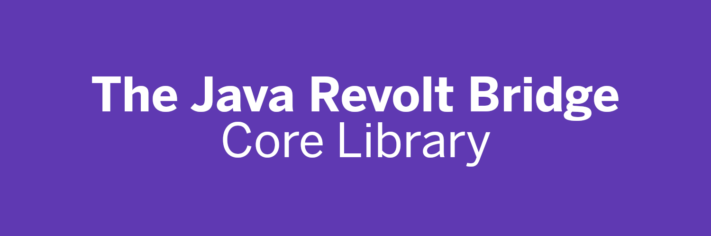

#   
  
The first Java client library for interacting with the Revolt chat platform.  
  
### Documentation

**See the [documentation at javadoc.io](https://www.javadoc.io/doc/ga.geist/jrv/latest/index.html)** or inline in your favorite IDE.

### Usage

You can see usage instructions and the current version on **[The Central Repository](https://search.maven.org/artifact/ga.geist/jrv)**.


#### Gradle  
```groovy
// Groovy DSL
implementation "ga.geist:jrv:[current version]"

// Kotlin
implementation("ga.geist:jrv:[current version]")
```

#### Maven 
```xml
<dependency>
  <groupId>ga.geist</groupId>
  <artifactId>jrv</artifactId>
  <version>[current version]</version>
</dependency>
```

#### SBT
```c
libraryDependencies += "ga.geist" % "jrv" % "[current version]"
```

### Example Application

This is a very simple example application implemented in Java. It replies to any message with the content "`?jrv`" with "The Java Revolt Bridge".
```java
import ga.geist.jrv.RevoltBridge;
import ga.geist.jrv.RevoltEventListener;
import ga.geist.jrv.auth.AuthStrategy;
import ga.geist.jrv.auth.ExistingSession;
import ga.geist.jrv.events.*;

import java.net.URI;
import java.net.URISyntaxException;

public class App {
    public static class EventManager extends RevoltEventListener {
        @Override
        public void onEvent(Event event, RevoltBridge bridge) {
            if (event instanceof WSOpenEvent) {
                AuthStrategy auth = new ExistingSession(System.getenv("REVOLT_SESSION_ID"), System.getenv("REVOLT_SESSION_TOKEN"), System.getenv("REVOLT_USER_ID"));
                bridge.authenticate(auth);
            } else if (event instanceof WSErrorEvent) {
                ((WSErrorEvent)event).getException().printStackTrace();
            } else if (event instanceof MessageEvent) {
                MessageEvent msg = (MessageEvent)event;

                if (msg.getMessage().getContent().equals("?jrv")) {
                    msg.getMessage().getChannel().sendMessage("The Java Revolt Bridge");
                }
            }
        }
    }

    public static void main(String[] args) throws URISyntaxException {
        RevoltBridge jrv = new RevoltBridge(new URI("https://api.revolt.chat"));

        jrv.registerEventListener(new EventManager());
    }
}
```

### The Library in Use

You can see this library in use at [Unofficial REVOLT for Fabric](https://rvf.geist.ga) ([source code repository](https://gitlab.insrt.uk/infi/rvfabric)).  

### Warning  
  
This is a brand-new, highly experimental client library. The API can change any time, in hopes to provide a stable and highly polished API in the future. **Be sure to read the changelogs for any breaking changes every time you upgrade the library!**  